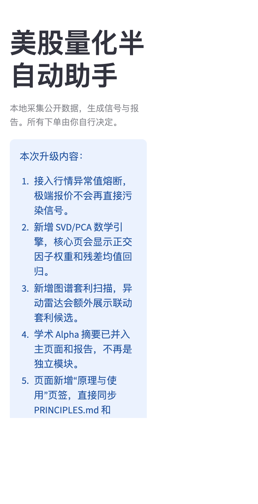
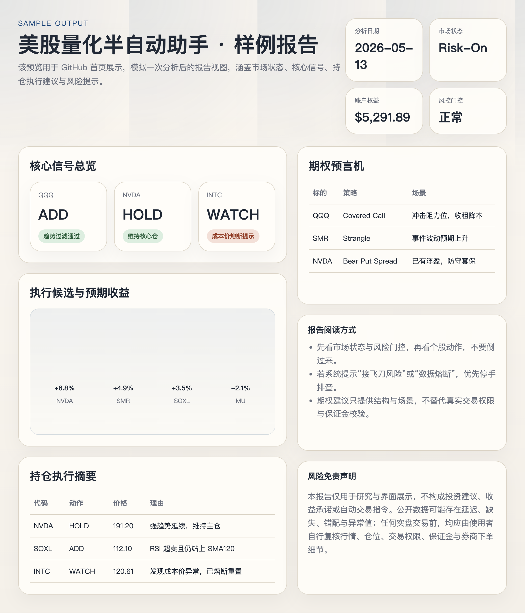
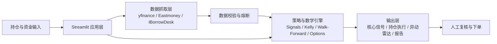

# 美股量化半自动助手

一个基于 Streamlit 的本地化美股研究与半自动执行工作台，用公开数据把市场状态、持仓变化、期权结构、风险门控和样本外验证压缩成可读、可复核、可执行的分析结果。

> 这不是自动交易系统。
>
> 系统负责生成研究结论和执行参考，最终是否下单、如何下单、是否承担风险，始终由使用者自己决定。

## 为什么做这个项目

很多个人投资工作流最大的问题，不是没有信号，而是信息碎片化：行情、持仓、宏观、期权、借券、回测、风险约束分散在不同页面里，导致决策成本很高。

这个项目的目标不是“神奇预测”，而是把这些离散输入整合成一套本地可运行、中文可读、适合人工复核的半自动分析系统。

## 核心能力

- 趋势过滤 RSI：只有在 RSI14 < 35 且 close > SMA120 时才允许低吸，避免纯超卖条件下的接飞刀。
- 持仓脏数据熔断：当成本价与当前市价偏离过大时，运行时自动熔断并重置，防止盈亏和仓位计算被污染。
- 扩展时段价格：支持盘前、盘中、夜盘价格抓取与中文展示。
- 期权策略预言机：生成 Covered Call、Bear Put Spread、Strangle 建议，附带到期盈亏图与香港盈立证券下单步骤。
- 数学增强：提供 SVD 正交化因子权重、PCA 残差均值回归、图谱套利候选和学术 Alpha 摘要。
- 风控与资金管理：支持凯利折扣、波动率压制、空头借券约束、动态保证金与账户预算门控。
- 样本外研究：内置 Walk-Forward 回测和稳健性验证，避免只看单次样本内表现。
- 报告输出：支持把分析结果整理成适合复盘和共享的报告与 JSON 结构。

## 界面预览

### 首页预览



### 样例报告预览



## 功能架构图



## 当前活跃策略框架

当前版本的现货主逻辑不是短周期追涨，而是更保守的趋势过滤均值回归：

1. RSI14 < 35：进入观察区。
2. close > SMA120：确认长期趋势未破坏，允许低吸。
3. close <= SMA120：判定为接飞刀风险，强制观望。
4. RSI14 >= 70：进入止盈或收缩区。
5. 仓位压制仍保留波动率公式：clip(0.20 / hist_vol_20d, 0.10, 0.80)。

## 你会在页面里看到什么

### 核心信号

- 市场状态与风险偏好判断
- 核心指数推演日志
- 期权流摘要
- 期权策略预言机
- 数学增强结果

### 持仓盈亏

- 账户总权益、闲余资金、多空敞口
- 当前持仓市值与浮盈亏
- 历史快照对比
- 成本价熔断提示

### 异动雷达

- 放量突破 / 破位候选
- 图谱套利候选
- 新 Alpha 目标排序

### 报告与 JSON

- 可复盘的摘要报告
- 可下游消费的结构化 JSON
- 面向人工检查的执行清单

## 快速开始

### 1. 克隆项目

```bash
git clone <your-repo-url>
cd stocks
```

### 2. 创建虚拟环境

macOS / Linux:

```bash
python3 -m venv .venv
source .venv/bin/activate
```

Windows PowerShell:

```powershell
python -m venv .venv
.venv\Scripts\Activate.ps1
```

### 3. 安装依赖

```bash
pip install -r requirements.txt
```

### 4. 启动应用

```bash
streamlit run app.py --server.port 8501
```

浏览器访问：

```text
http://localhost:8501
```

## 最小使用流程

1. 在左侧栏录入持仓、方向、股数、成本价与备注。
2. 填写账户总权益、空头基准保证金和仓位上限。
3. 调整凯利折扣，控制整体风险暴露。
4. 点击运行分析。
5. 查看核心信号、持仓盈亏、异动雷达、样本外回测与报告输出。

## 示例持仓模板

如果你准备第一次跑这个系统，可以先从类似下面的最小模板开始：

```json
[
   {
      "ticker": "NVDA",
      "side": "LONG",
      "shares": 10,
      "cost_basis": 191.20,
      "notes": "半导体/AI算力"
   },
   {
      "ticker": "QQQ",
      "side": "LONG",
      "shares": 2,
      "cost_basis": 520.00,
      "notes": "科技指数 ETF"
   }
]
```

## 目录结构

```text
.
├── app.py
├── config.py
├── data/
├── docs/
├── models/
├── portfolio/
├── reports/
├── snapshots/
├── walk_forward_validation.py
├── PRINCIPLES.md
├── USAGE.md
└── requirements.txt
```

## 关键模块

- [app.py](app.py)：Streamlit 主入口
- [data/fetcher.py](data/fetcher.py)：行情、扩展时段与回退数据源抓取
- [data/indicators.py](data/indicators.py)：RSI、ATR、波动率、均线等指标
- [models/signals.py](models/signals.py)：核心信号引擎
- [models/options_advisor.py](models/options_advisor.py)：期权策略预言机与盈亏图
- [walk_forward_validation.py](walk_forward_validation.py)：样本外回测与稳健性研究
- [PRINCIPLES.md](PRINCIPLES.md)：原理说明
- [USAGE.md](USAGE.md)：使用说明

## 数据源说明

- 行情：yfinance 为主，东方财富为回退
- 借券：IBorrowDesk
- 宏观：VIX、10Y Treasury、ETF 活跃度代理
- 新闻：yfinance 新闻接口

## 适用场景

- 本地管理美股多头 / 空头持仓
- 需要半自动执行参考而不是自动下单
- 想把信号、风控、期权建议、回测和报告放进同一个工作台

## 风险免责声明

1. 本项目仅用于研究、学习、界面展示与流程辅助，不构成投资建议。
2. 所有数据均来自公开源，可能存在延迟、缺失、错配或异常值。
3. 期权、杠杆和空头交易风险较高，实盘前应自行确认权限、保证金、流动性与券商下单细节。
4. 系统默认输出的是分析结论和执行参考，不是自动交易指令。
5. 即使页面显示通过门控，也不代表真实市场成交条件、滑点和风险已经被完全覆盖。

## 文档

- [原理说明](PRINCIPLES.md)
- [使用说明](USAGE.md)
